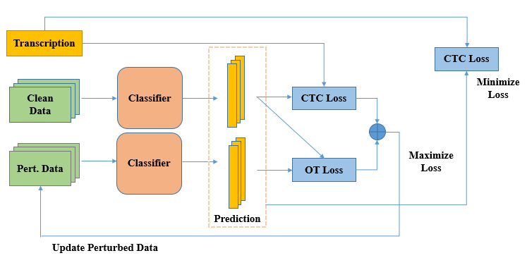

# mixPGD

This is the implementation for the mixPGD adversarial training paper. 



# Training type

| File name        |   Training Type    | 
| -------------  |:--------------------:| 
| standard_main.py       | Traditional training                    | 
| FGSM_main.py           | FGSM adversarial training                |  
| PGD_main.py          | PGD adversarial training                    |   
| feature_scatter_main.py      | Feature Scattering adversarial training                 |
| mixPGD_main.py   | mixPGD adversarial training                 |  

# How to run files

just use the following command on any of the file name mentioned above
```
python filename.py
```
# dataset
We have used LibriSpeech dataset in this experiment. You need to define the location of the dataset inside the .py files.

# Hyper-parameters
All the hyper-parameters can be changed in the individual .py files.

If any problems are faced regarding the code please contact at: aminul.huq11@gmail.com
